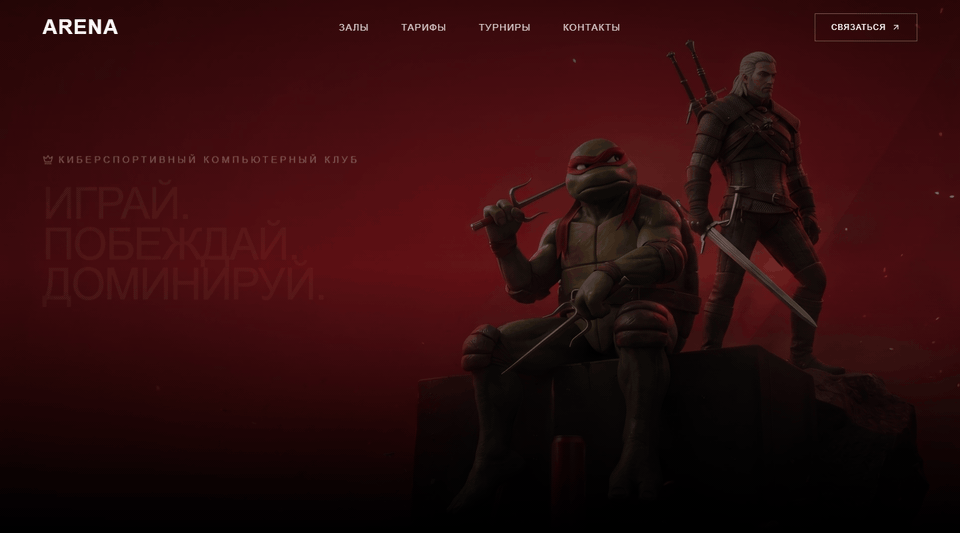
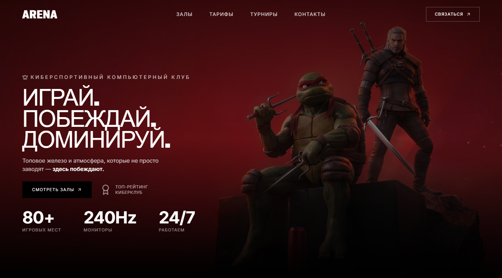
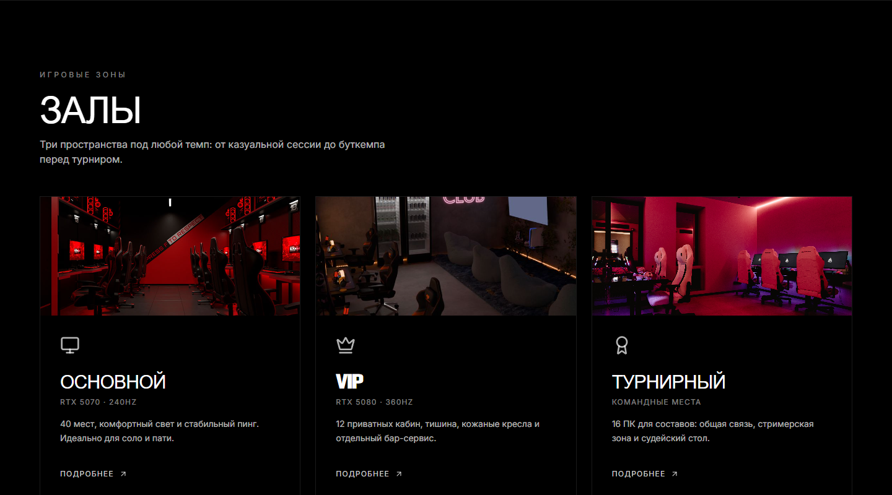
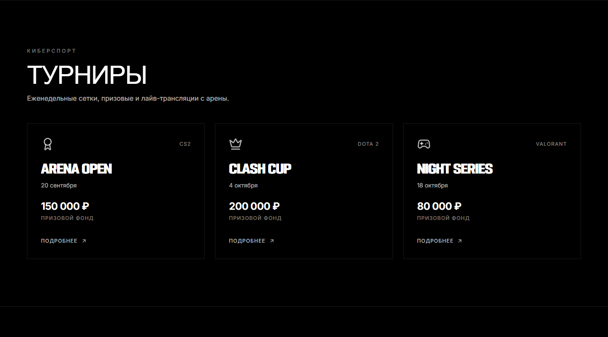

<p align="center">
  
</p>

<h1 align="center">ARENA</h1>

<p align="center">
  <strong>Киберспортивный компьютерный клуб</strong>
</p>

<p align="center">
  <em>Играй. Побеждай. Доминируй.</em>
</p>

<p align="center">
  Одностраничный лендинг с cinematic hero-видео, игровыми залами,<br>
  тарифами, турнирами и формой брони. Тёмная сцена, крупная типографика,<br>
  адаптив от 320px.
</p>

<p align="center">
  <a href="https://yandiev3.github.io/arena/"><strong>https://yandiev3.github.io/arena/</strong></a>
</p>

<p align="center">
  
  
  
  
</p>

---

## Интерфейс

<p align="center">
  
</p>

<p align="center">
  <sub>Полноэкранный hero с зацикленным видео, навбаром и CTA</sub>
</p>

<table>
  <tr>
    <td width="50%" valign="top">
      
      <p align="center"><sub><b>Залы</b> — основной, VIP и турнирный зал с фото и модалками</sub></p>
    </td>
    <td width="50%" valign="top">
      
      <p align="center"><sub><b>Турниры</b> — сетки, призовые фонды и подробности по клику</sub></p>
    </td>
  </tr>
</table>

---

## Что внутри

- **Cinematic hero** — полноэкранное видео, оверлей, слоган и метрики клуба
- **Навигация** — фиксированный навбар и мобильное меню-оверлей
- **Залы** — карточки с фото, железом и модалкой описания
- **Тарифы** — час, прайм, VIP и ночной пакет
- **Турниры** — CS2, Dota 2, Valorant с правилами и дедлайнами
- **Бронь** — форма в контактах с предзаполнением из зала, тарифа или турнира
- **Адаптив** — вёрстка от 320px, отдельный кадр hero-видео на узких экранах

Модалки закрываются по Escape и клику на фон. Скролл страницы блокируется, пока открыто меню или модалка.

---

## Стек

| Слой | Инструмент |
| --- | --- |
| UI | React 19, TypeScript |
| Сборка | Vite |
| Стили | Tailwind CSS, шрифты Podium Sharp + Inter |
| Иконки | lucide-react |
| Данные | `src/data.ts` — залы, тарифы, турниры |

Маршрутизации нет: одна страница, якорные секции.

---

## Запуск

```bash
npm install
npm run dev
```

Сборка продакшена:

```bash
npm run build
npm run preview
```

---

## Структура

```text
src/
  App.tsx                 # страница: hero → залы → тарифы → турниры → контакты
  data.ts                 # контент клуба
  index.css               # Tailwind + кадрирование hero-видео
  components/
    BookingForm.tsx       # заявка на бронь
    HallModal.tsx         # описание зала
    TournamentModal.tsx   # описание турнира
    Modal.tsx             # общий оверлей
public/halls/             # фото залов
docs/                     # превью для README
```

---

<p align="center">
  <sub>Демо-лендинг. Не настоящий клуб — атмосфера настоящая.</sub>
</p>
